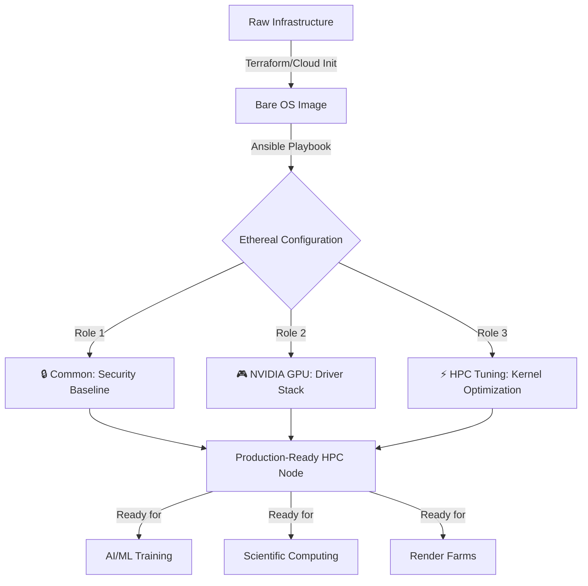

<div align="center">

# ⚡ Ethereal: Ansible HPC Node Configurator

### *Automated Infrastructure Configuration for High-Performance Computing*

[](https://github.com/MarkChisholm-dev/Ethereal-Ansible-Config/actions/workflows/ansible-lint.yml)
[](https://www.ansible.com/)
[](https://ubuntu.com/)
[](https://www.nvidia.com/)
[](https://www.ttpn.org/)

</div>

---

## 📋 Table of Contents

- [Overview](#-overview)
- [Features](#-features)
- [Architecture](#-architecture)
- [Quick Start](#-quick-start)
- [Configuration Layers](#-configuration-layers)
- [Advanced Usage](#-advanced-usage)
- [Role Variables](#-role-variables)
- [Project Structure](#-project-structure)
- [Contributing](#-contributing)
- [License](#-license)

---

## 🌟 Overview

**Ethereal** is an enterprise-grade Ansible automation framework designed to transform bare-metal or cloud-provisioned compute nodes into **production-ready HPC environments**. 

This repository bridges the gap between raw infrastructure (Terraform/OpenStack/AWS) and fully optimized, security-hardened compute fleets running GPU-accelerated workloads.

### Why Ethereal?

- 🔒 **Security First**: CIS Benchmark SSH hardening and audit logging compliance out of the box
- 🚀 **Performance Optimized**: Kernel-level tuning for high-throughput networking and GPU workloads
- 🎯 **Idempotent & Reproducible**: Consistent configurations across hundreds of nodes
- 🔧 **Modular Design**: Enable/disable components as needed with feature flags
- 📊 **HPC-Ready**: Optimized for scientific computing, AI/ML training, and rendering farms

---

## ✨ Features

<table>
<tr>
<td width="50%">

### 🛡️ Security & Compliance
- ✅ SSH hardening (disable root login, enforce key-based auth)
- ✅ Fail2Ban intrusion prevention
- ✅ Auditd compliance logging
- ✅ Optional full system dist-upgrade
- ✅ TPN-ready compliance baseline

</td>
<td width="50%">

### ⚙️ Performance Tuning
- ⚡ Optimized TCP buffer sizes (16MB)
- ⚡ Enhanced memory mapping (vm.max_map_count)
- ⚡ NVIDIA GPU persistence mode
- ⚡ High-concurrency network stack tuning
- ⚡ Headless server driver optimization

</td>
</tr>
</table>

---

## 🏗️ Architecture



---

## 🚀 Quick Start

### Prerequisites

- Ansible 2.9+
- Ubuntu/Debian target hosts
- SSH key-based authentication configured
- Sudo access on target nodes

### Installation

**1. Clone this repository:**
```bash
git clone https://github.com/MarkChisholm-dev/Ethereal-Ansible-Config.git
cd Ethereal-Ansible-Config
```

**2. Install required Ansible collections:**
```bash
ansible-galaxy collection install -r requirements.yml
```

**3. Configure your inventory:**
```ini
# inventory.ini
[compute_nodes]
node01.ethereal.cloud ansible_host=10.0.1.10
node02.ethereal.cloud ansible_host=10.0.1.11
node03.ethereal.cloud ansible_host=10.0.1.12
```

**4. Run the playbook:**
```bash
ansible-playbook -i inventory.ini site.yml --limit compute_nodes
```

**5. Verify deployment:**
```bash
# Check NVIDIA driver installation
ansible compute_nodes -i inventory.ini -m shell -a "nvidia-smi"

# Verify sysctl tuning
ansible compute_nodes -i inventory.ini -m shell -a "sysctl net.core.rmem_max"
```

---

## 🔧 Configuration Layers

### 1️⃣ **Common Role** - Security Baseline

Establishes a hardened operating system foundation compliant with industry security standards.

| Component | Purpose |
|-----------|---------|
| **Package Management** | Installs essential tools (curl, git, htop) and updates apt cache |
| **SSH Hardening** | Disables root login, enforces key-based authentication |
| **Intrusion Prevention** | Configures Fail2Ban for brute-force protection |
| **Audit Logging** | Enables auditd for compliance and forensic analysis |

**Key Variables:**
- `common_perform_dist_upgrade`: false (set to true for full OS upgrade)
- `common_baseline_packages`: [curl, git, htop, auditd, fail2ban]

---

### 2️⃣ **NVIDIA GPU Role** - GPU Orchestration

Automates NVIDIA driver installation and optimizes GPU performance for compute workloads.

| Feature | Description |
|---------|-------------|
| **Driver Installation** | Headless NVIDIA server drivers (535+) from graphics-drivers PPA |
| **Kernel Headers** | Automatically installs matching kernel headers for DKMS |
| **Persistence Mode** | Keeps GPU initialized for faster job startup times |
| **Platform Validation** | Ensures compatibility with Ubuntu/Debian systems |

**Key Variables:**
- `nvidia_gpu_enabled`: true (set to false to skip GPU configuration)
- `nvidia_gpu_driver_package`: nvidia-headless-535-server
- `nvidia_gpu_enable_persistence_mode`: true

---

### 3️⃣ **HPC Tuning Role** - Performance Optimization

Applies kernel-level optimizations for high-throughput networking and memory-intensive workloads.

| Parameter | Value | Impact |
|-----------|-------|--------|
| `net.core.rmem_max` | 16MB | Maximum receive buffer size for high-bandwidth transfers |
| `net.ipv4.tcp_rmem` | 4KB → 16MB | Dynamic TCP receive window scaling |
| `net.ipv4.tcp_wmem` | 4KB → 16MB | Dynamic TCP send window scaling |
| `vm.max_map_count` | 262144 | Memory map limit for large-scale applications |

**Configuration File:** `/etc/sysctl.d/99-hpc-tuning.conf`

---

## 🎛️ Advanced Usage

### Scenario 1: Full System Upgrade + GPU Configuration
```bash
ansible-playbook -i inventory.ini site.yml \
  -e common_perform_dist_upgrade=true \
  --limit gpu_nodes
```

### Scenario 2: CPU-Only Nodes (Skip NVIDIA)
```bash
ansible-playbook -i inventory.ini site.yml \
  -e nvidia_gpu_enabled=false \
  --limit cpu_nodes
```

### Scenario 3: Dry Run (Check Mode)
```bash
ansible-playbook -i inventory.ini site.yml --check --diff
```

### Scenario 4: Run Only Specific Roles
```bash
# Security hardening only
ansible-playbook -i inventory.ini site.yml --tags common

# GPU configuration only
ansible-playbook -i inventory.ini site.yml --tags nvidia_gpu
```

---

## 📊 Role Variables

<details>
<summary><b>Common Role Variables</b></summary>

```yaml
# /roles/common/defaults/main.yml
common_apt_cache_valid_time: 3600
common_perform_dist_upgrade: false
common_ssh_service_name: ssh
common_baseline_packages:
  - curl
  - git
  - htop
  - auditd
  - fail2ban
common_ssh_hardening_rules:
  - regexp: '^PermitRootLogin'
    line: 'PermitRootLogin no'
  - regexp: '^PasswordAuthentication'
    line: 'PasswordAuthentication no'
```
</details>

<details>
<summary><b>NVIDIA GPU Role Variables</b></summary>

```yaml
# /roles/nvidia_gpu/defaults/main.yml
nvidia_gpu_enabled: true
nvidia_gpu_install_kernel_headers: true
nvidia_gpu_enable_persistence_mode: true
nvidia_gpu_driver_apt_repo: "ppa:graphics-drivers/ppa"
nvidia_gpu_driver_package: nvidia-headless-535-server
```
</details>

<details>
<summary><b>HPC Tuning Role Variables</b></summary>

```yaml
# /roles/hpc_tuning/defaults/main.yml
hpc_tuning_sysctl_file: /etc/sysctl.d/99-hpc-tuning.conf
hpc_tuning_sysctl_params:
  - name: net.core.rmem_max
    value: '16777216'
  - name: net.ipv4.tcp_rmem
    value: '4096 87380 16777216'
  - name: net.ipv4.tcp_wmem
    value: '4096 65536 16777216'
  - name: vm.max_map_count
    value: '262144'
```
</details>

---

## 📁 Project Structure

```
Ethereal-Ansible-Config/
├── 📄 site.yml                    # Main playbook entry point
├── 📄 requirements.yml            # Ansible Galaxy dependencies
├── 📄 README.md                   # This file
├── 📄 LICENSE                     # Project license
│
└── roles/
    ├── common/                    # Security & baseline configuration
    │   ├── defaults/main.yml
    │   ├── tasks/main.yml
    │   └── handlers/main.yml
    │
    ├── nvidia_gpu/                # GPU driver installation
    │   ├── defaults/main.yml
    │   ├── tasks/main.yml
    │   └── handlers/main.yml
    │
    └── hpc_tuning/                # Kernel optimization
        ├── defaults/main.yml
        ├── tasks/main.yml
        └── handlers/main.yml
```

---

## 🤝 Contributing

Contributions are welcome! Please follow these guidelines:

1. **Fork** the repository
2. **Create** a feature branch (`git checkout -b feature/amazing-feature`)
3. **Commit** your changes (`git commit -m 'Add amazing feature'`)
4. **Push** to the branch (`git push origin feature/amazing-feature`)
5. **Open** a Pull Request

### Development Guidelines
- Ensure all tasks are idempotent
- Run `ansible-lint` before submitting PRs
- Update documentation for new variables
- Test on clean Ubuntu installations

---

## 📜 License

This project is licensed under the terms specified in the [LICENSE](LICENSE) file.

---

## 🙏 Acknowledgments

- Built with [Ansible](https://www.ansible.com/) automation
- NVIDIA driver management inspired by community best practices
- Kernel tuning recommendations from HPC performance research

---

<div align="center">

**Made with ⚡ for High-Performance Computing**

[⬆ Back to Top](#-ethereal-ansible-hpc-node-configurator)

</div>
